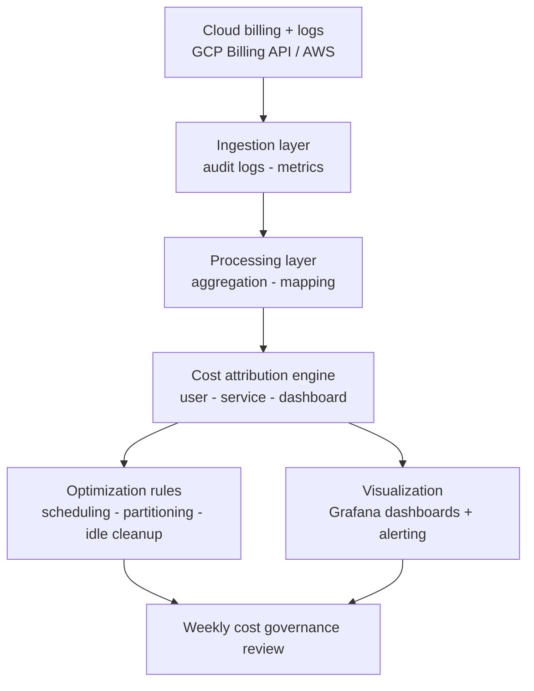

# Cloud Cost Intelligence Platform

> **Delivered ~$2.3M in annual cloud savings across 8+ engineering teams** by building a real-time cost attribution and FinOps governance platform, shifting the org from reactive cost discovery to proactive spend management.

> Program case study based on a production platform. The metrics below are from that program. This repo documents the design and operating model; it is not a runnable distribution.

---

## The problem

Cloud costs grow fast in large orgs without clear attribution to teams, services, or workloads. Engineering teams could not see which queries, dashboards, or services drove spend, so cost spikes were found after the fact, when correction is expensive and slow. The core challenge was behavioral, not technical: teams cannot optimize what they cannot see.

## The solution

A centralized platform that gives real-time visibility into cloud spend across services, teams, and workloads. It attributes costs to individual teams, surfaces high-cost queries and workloads, and enforces governance through dashboards and optimization workflows, enabling proactive spend management at scale.

## Program impact

| Metric | Result |
|---|---|
| Annual cloud savings | ~$2.3M |
| BigQuery cost reduction | ~30 to 35% |
| Engineering teams onboarded | 8+ |
| Cost attribution coverage | End-to-end (user to service to dashboard) |
| Insight mode | Real-time |

## Architecture

**Key components**
- **Ingestion** pulls billing and audit-log data from GCP Billing API and Cloud Monitoring
- **Attribution engine** maps cost to teams, users, dashboards, and services
- **Optimization rules** flag inefficiencies: unpartitioned tables, high-frequency queries, idle resources
- **Visualization** surfaces actionable cost breakdowns in real time via Grafana

## How it works

1. **Ingest** billing logs and usage metrics into a centralized pipeline
2. **Attribute** costs to users, dashboards, and services via the attribution engine
3. **Analyze** to identify inefficiencies and savings opportunities
4. **Surface** insights to Grafana so teams can act
5. **Govern** spend in a weekly review; recommendations tracked to closure

## Reference implementation (illustrative)

This repo describes the platform; it does not ship a runnable package. A faithful implementation would include:

- A Python ingestion job reading the GCP Billing BigQuery export and Cloud Monitoring metrics
- An attribution module mapping labels and audit logs to owners
- A rules module flagging unpartitioned tables, idle resources, and high-cost queries
- Grafana dashboard definitions for per-team and per-service breakdowns

For a runnable, CI-tested example of an ML/LLM evaluation and release pipeline in this portfolio, see [Model-Eval-and-Release-Pipeline](https://github.com/gkcloudai/Model-Eval-and-Release-Pipeline).

## Tradeoffs and design decisions

**Visibility-first over automated enforcement:** shipping dashboards before enforcement drove faster adoption. Teams optimized voluntarily once they could see their own spend. Enforcement without visibility creates friction.

**Grafana over a custom UI:** existing familiarity shortened time-to-adoption. A custom UI would have added 6 to 8 weeks of delivery risk for marginal benefit.

**What I would do differently:** introduce automated guardrails and budget alerts earlier. Reactive optimization has diminishing returns; proactive thresholds compound savings faster.

## What I learned

- Visibility changes behavior more effectively than policy enforcement.
- Cost optimization is as much a cultural problem as a technical one.
- Attribution granularity, mapping cost to the right owner at the right level, is the hard problem and needs upfront data modeling.

## Next steps

- [ ] Automated cost alerts via Slack and email
- [ ] Budget enforcement with soft and hard caps
- [ ] Predictive cost modeling from historical trends
- [ ] Self-serve optimization recommendations in an internal developer portal

## Built with

BigQuery | GCP Billing API | Cloud Monitoring | Grafana | Python

## Author

**Gaurav Kumar** | [LinkedIn](https://www.linkedin.com/in/gauravkumar2)
